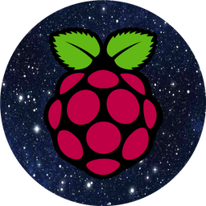

<!-- PROJECT LOGO -->
 

  

  <h3 align="center">AstroPitography</h3>

  

    Astrophotography + Raspberry Pi HQ camera = AstroPitography
     
    <a href="https://github.com/adambaskerville/AstroPitography/issues">Request Feature</a>
  

<!-- TABLE OF CONTENTS -->
## Table of Contents

* [About AstroPitography](#about-the-project)
  * [Built With](#built-with)
  * [Uses](#uses)
* [Getting Started](#getting-started)
* [Roadmap](#roadmap)

<!-- ABOUT THE PROJECT -->
## About AstroPitography

Astrophotography is an expensive pastime, scopes, driven mounts, cameras, eyepieces, etc... I have always enjoyed squeezing as much performance out of more limited hardware to see what the end results can be; so when the **£50** Raspberry Pi High Quality camera was released I wanted to see how it handles astrophotography. It will certainly not beat a top of the line DSLR or a ZWO camera which are several orders of magnitude more expensive and refined, but I wanted to see what can be achieved. I wrote this simple Python program to act as a basic GUI for when I am out with my telescope. The Raspberry Pi 3B+ and HQ camera were mounted together and using a 1.25 inch to C adapter sits in the telescope eyepiece position. I set up the Raspberry Pi to act as a wireless access point and connect to its network via VNC on my phone to conveniently interface with the GUI. A small Raspberry Pi screen will also work great or just hooking it up to a regular monitor.

I had originally used stellarmate with kstars etc... but wanted a simpler way to interface with the HQ camera. This is only the first iteration of the program which currently has the following features:

* Control important settings of the camera:
  * Brightness
  * Contrast
  * Saturation
  * Sharpness
  * Exposure (shutter speed in this instance)
  * Time delay between images
* Show a live preview of the camera view in the main window; useful for making sure something is in frame.
* Ability to enlarge and shrink the live preview using GUI buttons.
* Toggle greyscale imaging (useful if using colour filters) and auto white balance correction.
* Allows for capturing of single images, multiple images with time delay and long exposure imaging.
* When a picture is taken it will be visible next to the live preview. If it is a poor image it can be deleted from within the program.
* The default save location can be selected from within the program window; handy for saving to USB stick etc... especially for large RAW files.
* Timed video capturing.
* The image save format is `RAW`, preferred over `png` which processes the image. `png` is used when showing the most recent image taken. An option is provided to extract the RAW image information from the .jpg file and saved as a dng file using PiDNG.

### Built With

* [PySimpleGUI](https://pysimplegui.readthedocs.io/en/latest/)
* [OpenCV](https://opencv.org/)
* [Raspistill](https://www.raspberrypi.org/documentation/usage/camera/raspicam/raspistill.md)

### Uses (Not endorsements or sponsors, just where I purchased them from)
* [Raspberry Pi 3B+](https://thepihut.com/products/raspberry-pi-3-model-b-plus)
* [Raspberry Pi HQ Camera](https://thepihut.com/products/raspberry-pi-high-quality-camera-module)

In theory any Raspberry Pi should work, along with the other various Raspberry Pi cameras.

<!-- GETTING STARTED -->
## Getting Started

It is a self contained Python program. Type:

`python3 AstroPitography.py`

into a terminal on your raspberry pi to run the program and start taking pictures and videos. Editing your `.bashrc` can allow for the program to begin on startup. You can specify the image save location from the menu button at the top of the window.

**Note:**

My Raspberry Pi's resolution was set to 1600 x 900, 16:9 which you may want to replicate when using the program. I plan to generalize the code for any resolution in the future.
## Dependencies

Below are some key dependencies and library versions to run AstroPitography: 

`picamera==1.13`

`pidng==3.4.7`

`Pillow==8.4.0`

`PySimpleGUI==4.55.1`

<!-- ROADMAP -->
## Roadmap

 * More testing (when the skies finally improve here in rainy UK!)
 * Allow for fractional variability in shutter speed (simple to implement)
 * Improve framerate of live preview. [**completed**]
 * Improve features of video implementation.
 * The ability to load camera presets for different objects (e.g. planetary, deep sky etc...)
 * Automatic image stacking capability.

<!-- CONTACT -->
## Contact

Adam Baskerville - [@AdamBask](https://twitter.com/AdamBask) - ab695@sussex.ac.uk

Project Link: [https://github.com/adambaskerville/AstroPitography](https://github.com/adambaskerville/AstroPitography)

## Examples

The following lovely images were taken by Herbert Fu:

**M45 galaxy:**

**M31 galaxy:**

**Jupiter:**

This is an image of the moon I captured:

