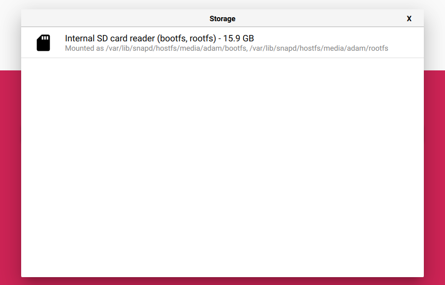

---
jupytext:
  formats: md:myst
  text_representation:
    extension: .md
    format_name: myst
kernelspec:
  display_name: Python 3
  language: python
  name: python3
---

# Complete Setup Guide

In this guide, we will cover how to setup a Raspberry Pi from scratch in order to use AstroPitography. I decided to write this as this process may seem daunting to a newcomer; especially as there is a lot of advice online, a lot of which is out of date or non-optimal. Here we will discuss some easy to use tools and methods to get your Pi setup as pain-free as possible.

We will discuss how to setup your Pi to be **headless** which means you will not need a monitor, mouse or keyboard in order to interact with it. For users who are new to the Raspberry Pi this is often the main annoyance with using one as need to have multipl peripherals just to use it. Instead we will just need a single ethernet cable linking the Raspberry Pi to your laptop in order to interact with it.

i use Linux so the terminal commands you see below are specific to Linux. The corresponding Windows shell arguments can be found via Google (I may add these to the guide if I get access to a Windows machine to test the setup guide).

# What You Will Need

* A Raspberry Pi board. I am using an older [3B+](https://www.raspberrypi.com/products/raspberry-pi-3-model-b-plus/).
* Power Supply. I am using the [official](https://www.raspberrypi.com/products/raspberry-pi-universal-power-supply/) Raspberry Pi power supply for a 3B+. Make sure to get the correct one for your model (the older ones use micro USB whereas the new Pi's use USB-C).
* MicroSD card. Any microSD card will do but make sure it has a suitable amount of space on it. I personally recommend [SanDisk Extreme Pro](https://www.amazon.co.uk/dp/B09X7DNF6G?ref=ppx_yo2ov_dt_b_product_details&th=1) SD cards as these offer faster transfer rates and they are not too expensive. 
* A Raspberry Pi camera. I use the [Raspberry Pi HQ camera](https://www.raspberrypi.com/products/raspberry-pi-high-quality-camera/).
* Ethernet cable.

# Write Raspberry Pi Bullseye OS to MicroSD

1. Download Raspberry Pi Imager.
    
    The [Raspberry Pi imager](https://www.raspberrypi.com/software/) is the quick and easy way to install Raspberry Pi OS and other operating systems to a microSD card. Once installed, run the software and you will be greeted with the following screen.

    

2. Click the `CHOOSE DEVICE` button and select your raspberry Pi model; I choose `Raspberry Pi 3`, but make sure to select your model.

    

3. Click the `CHOOSE OS` button and select the `RASPBERRY PI OS (LEGACY, 32-BIT)` which will install the Debian Bullseye OS. **Note** Make sure that it is 32-bit! 64-bit operating systems will not currently work with AstroPitography due to a compatibility issue with the `picamera` library. This is being worked on and the guide will be updated when fixed.

    

4. Click the `CHOOSE STORAGE` button and select your microSD card which should be listed.

    

5. Once all these options have been correctly specified, click the `Next` button in the bottom right of the window. This will bring up the following window asking if you want to apply OS customisation settings. Click `YES`.


    

6. After selecting `Yes`, it will ask if you want to wipe all data on the SD card, click `Yes`. **Remember** Make sure you are fine with formatting your selected microSD card for use with AstroPitography.

7. We now want to specify options in order to make the Raspberry Pi headless. First we look at the `General` tab. 

    

    We set a username and password for the Raspberry Pi. The default username is `pi` and the default password is `raspberry`.

    Next, set your WIFI details in order for the Pi to send and receive data. I put some placeholders in, but make sure to enter your WIFI network SSID (network name) and the WIFI password.

8. Next we look at the `Services` tab.

    

    In this menu, select `Enable SSH`. This is **crucial** as we want to Secure SHell, SSH, into our Raspberry Pi from our laptop. If this is not enabled here then we will need to hook up a keyboard, mouse and monitor to our Pi in order to interact with it.

9. When you’ve finished entering OS customisation settings, click `Save` to save your customisation. 

    Then, click `Yes` to apply OS customisation settings when you write the image to the storage device. 
    
    Finally, respond `Yes` to the *"Are you sure you want to continue?"* popup to begin writing data to the storage device. 
    
    If you see an admin prompt asking for permissions to read and write to your storage medium, it’s safe to proceed.

10. Now we just need to wait for the imager to write the OS to your microSD. if it is successful then you should see the following output.

    

11. You now need to put the formatted SD card into your Raspberry Pi, plug the Pi in and turn on.

# SSH to Raspberry Pi

Now we have formatted the microSD card and plugged in the Raspberry Pi, we are now ready to connect to it over SSH.

1. Connect one end of your ethernet cable into your laptop and the other into the Raspberry Pi. Wait a few minutes in order for the connection to be realised between the two devices.

2. Open up a terminal and type

    ```shell
    ssh pi@raspberrypi.local
    ```

    Then enter your password when prompted. **NOTE**, For raspberry pi imager versions < 1.8.4 there is a bizarre bug in the GUI when you set your login password for the Raspberry Pi. Typing in the password at the ssh prompt will not work and deny access. Remove the first character of your password when you type it and it should work.

    You may get the following error:

    ```shell
    The authenticity of host 'raspberrypi.local (IP_ADDRESS)' can't be established.
    ECDSA key fingerprint is SHA256:ExzAERdWpiKD3R6qAYilZtUO7rkGeHfhZq+ZaQCZmNk.
    Are you sure you want to continue connecting (yes/no/[fingerprint])? yes
    Warning: Permanently added 'raspberrypi.local' (ECDSA) to the list of known hosts.
    Warning: the ECDSA host key for 'raspberrypi.local' differs from the key for the IP address 'IP_ADDRESS'
    Offending key for IP in /home/adam/.ssh/known_hosts:16
    ```
    **Note** that you will have an actual IP address in place of `IP_ADDRESS`. If you do  get this error then type the following into your terminal to remove the ssh key for this address (enter the specified IP address from the error in place of `IP_ADDRESS`).

    ```shell
    ssh-keygen -R IP_ADDRESS
    ```

    Now rerun

    ```shell
    ssh pi@raspberrypi.local
    ```

    and enter the username and password which we set in the OS customisation options above in Raspberry Pi Imager.

3. You should now have access to the raspberry pi through the terminal. Do **not** exit the terminal window just yet!

# Easier Access Using VNC

1. Using the terminal is great, but it is much easier and required for AstroPitography to be able to see the desktop of the Raspberry Pi. In order to do this we are going to use VNC. Now we are connected to the Raspberry Pi through SSH, we want to enable VNC in order to view the desktop. To do this type the following in the terminal.

    ```shell
    sudo raspi-config
    ```

    This should ring up the following window.

    

    Using the arrows on your keyboard, go to `Interface Options` and press Enter. From here select `VNC`.

    

    This will ask you if you want VNC Server enabled, select `YES`.

    


2. Download [RealVNC Viewer](https://www.realvnc.com/en/connect/download/viewer/)

3. When installed, run `RealVNC Viewer`.

    

    In the `Address` box, enter `raspberrypi.local` and click `Connect`. This will ask you the login information of your Raspberry Pi.

4. You should now see the desktop of your Raspberry Pi!

    

5. AstroPitography relies on being able to see the GUI through your VNC window on you laptop. If using VNC you may need to enable live preview in VNC itself. [Here](https://www.youtube.com/watch?v=dbBWyeHbGs0) is a short video on how to do this.

# Enable Legacy Camera Support

1. Open a terminal window in your Raspberry Pi window and type the following.

    ```shell
    sudo raspi config
    ```

2. Use the arrow keys to scroll down to `Interface Options` and press enter.

    

3. Use the arrow keys  to scroll to `Legacy Camera` and press enter.

    

4. Use the cursor keys to select `<Yes>` and press the enter key.


    

5. Then select `Finish` to restart the device.

    

6. You should now be ready to start using AstroPitography!

# Install AstroPitography

